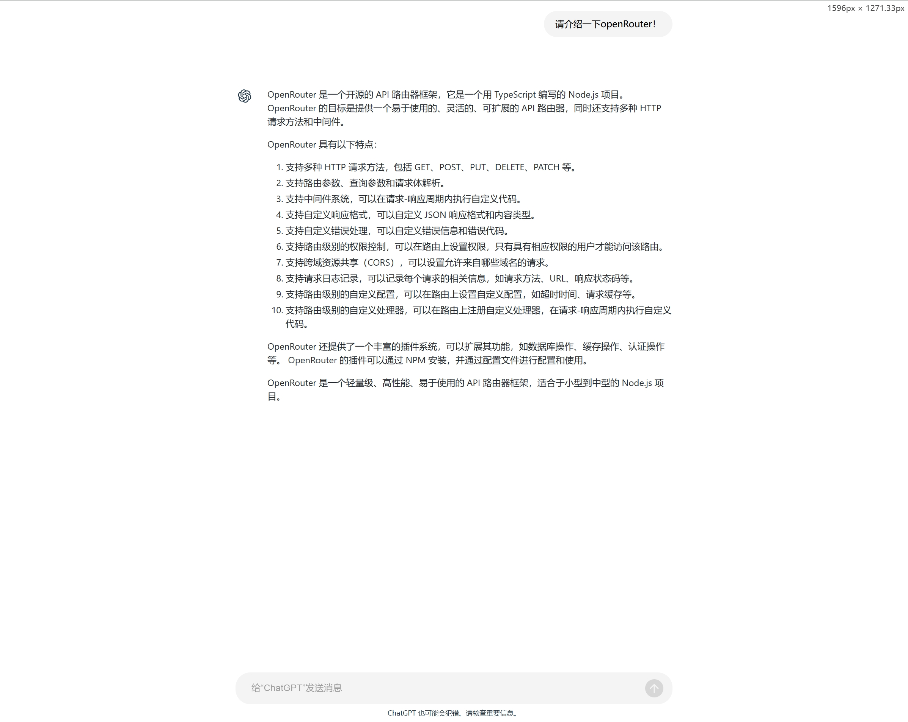
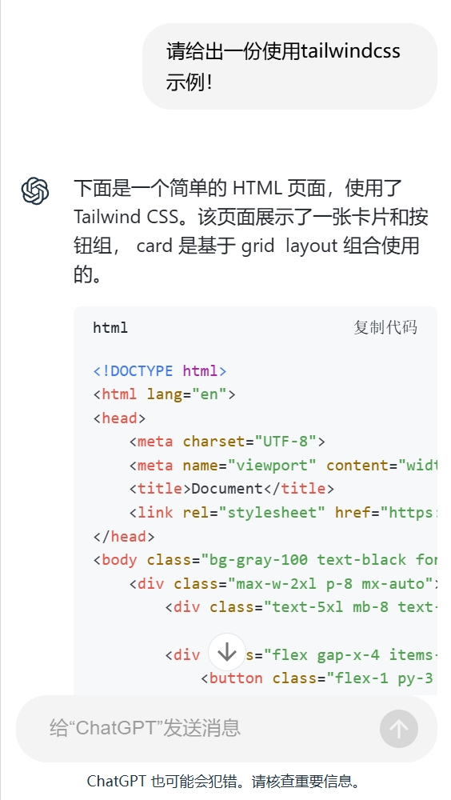

# ChatGPT Demo

欢迎使用 ChatGPT Demo 项目！这是一个基于 React 和 TypeScript 的示例应用，展示了如何与 OpenAI 的 ChatGPT API 进行交互。
该项目使用https://openrouter.ai/nousresearch/hermes-3-llama-3.1-405b:free 模型，OpenRouter API key请自行注册




## 目录

- [功能](#功能)
- [技术栈](#技术栈)
- [安装与运行](#安装与运行)
- [使用说明](#使用说明)

## 功能

- 实时与 ChatGPT 进行对话
- 通过输入 OpenAI API Key 来进行身份验证
- 响应式布局，适配各种设备

## 技术栈

- **前端框架**: React
- **类型**: TypeScript
- **样式**: Ant Design, TailwindCSS
- **数据请求**: @microsoft/fetch-event-source

## 安装与运行

要运行此项目，请按照以下步骤进行操作：

```bash
npm install
npm run dev
```

## 使用说明

启动应用后，输入你的 OpenAI API Key。
提交 API Key 后，开始与 ChatGPT 进行对话。
输入消息并查看 ChatGPT 的回复。
